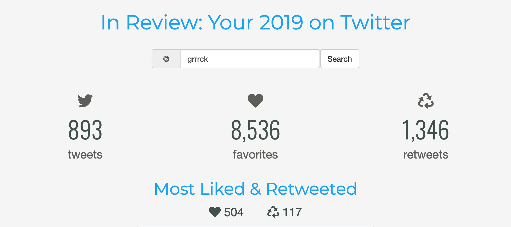

# Your 2019 on Twitter

### A fun little [Shiny] app inspired by a [tweet by &commat;nnstats][nnstats].

---

<!-- badges: start -->
<!-- badges: end -->

---

### Caveat emptor

The app is at the nice-enough-to-share prototype stage.
If anything looks wonky, odd, or out of place, it's probably just me moving quickly.
I'm sure some of the things I did here are good ideas or maybe even good practice, 
but not everything is, 
so please take it all with a grain of salt if you're looking to learn something new.

I'm putting the code online because I'd rather share — and to be able to find it again!

[shiny]: https://shiny.rstudio.com
[nnstats]: https://twitter.com/nnstats/status/1212177130949357569
